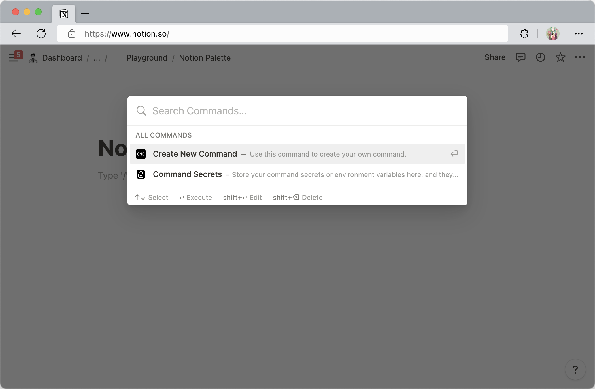

<p align="center">
  
</p>

<p align=center>
  <a href="https://github.com/ruter/notion-palette/blob/main/LICENSE">
    
  </a>
  <a href="https://github.com/topics/javascript">
    
  </a>
  <a href="https://github.com/ruter/notion-palette/issues">
    
  </a>
  <a href="https://github.com/ruter/notion-palette">
    
  </a>
</p>

---

# Notion Palette

Supercharge your All-in-One workspace with the Command Palette within Notion 🕹️

Notion Palette is a free and open source extension, you can create commands and
execute scripts within Notion. Such as take a quick note, change page's icon and title,
sync your schedule and anything else you can imagine.




## Installation

Firstly, clone this repo or download the code from website of [GitHub](https://github.com/ruter/notion-palette),
by clicking the green **Code** button and then click **Download ZIP**,
or just click the link [here](https://github.com/ruter/notion-palette/archive/refs/heads/main.zip) to download it.

```bash
git clone https://github.com/ruter/notion-palette.git
```

Then, follow the instruction of [Load an unpacked extension](https://developer.chrome.com/docs/extensions/mv3/getstarted/#unpacked)
or below to load Notion Palette extension:

1. If it's ZIP file, extract the contents somewhere

2. In Chrome or any other Chromium browser like Edge and Brave, navigate to `chrome://extensions`

3. Toggle on the **Developer mode** and click **Load Unpacked**

4. Navigate to the local folder containing the extension’s code and click OK

5. Assuming there are no errors, the extension should load into your browser

Done! You can start to use Notion Palette now 🎉


## Usage

Press `Alt` + `P` (`Option` + `P` for macOS) to open the Command Palette, then you can search, select and execute commands.

All operations are done within the Command Palette, so you can use it anywhere in the Notion,
there are some shortcuts you can use while you are open the Command Palette.

### Keyboard Shortcuts

| Shortcut                     | Action                       |
| ---------------------------- | ---------------------------- |
| `Alt/Option` + `P`           | Open Notion Palette          |
| `Shift` + `Enter`            | Edit the selected command    |
| `Shift` + `Backspace`        | Delete the selected command  |
| `Enter`                      | Execute the selected command |


## API Reference

#### Get environment variables

```javascript
getEnv(key)
```

| Parameter | Type     | Description                |
| :-------- | :------- | :------------------------- |
| `key`     | `string` | **Required**. The key of the environment variable |

After called this function, it will return a `Promise` object, you might like to use it like

```javascript
(async () => {
    const token = await getEnv('API_TOKEN');
    console.log(token);
    // do some stuff here...
})();
```

#### Get current page's ID

```javascript
getCurrentPageId()
```

Return current page's ID. If any page opened in database with *Side peek* or *Center peek* view, this
function will return the opened page's ID, otherwise it will return the database page's ID.

#### Copy text to clipboard

```javascript
copyText(text);
```

| Parameter | Type     | Description                         |
| :-------- | :------- | :---------------------------------- |
| `text`    | `string` | The text content write to clipboard |

Store text content to the clipboard.

#### Display a Toast

```javascript
showToast(content)
```

| Parameter | Type     | Description                       |
| :-------- | :------- | :-------------------------------- |
| `content` | `string` | **Required**. The message you want to display |

This function will display a Toast at the page's bottom.


## Roadmap

- [ ] Add `showDialog()` API 
- [ ] Import command via gist
- [ ] Add more API


## Contributing

Contributions are always welcome!

Please feel free to open an [issue](https://github.com/ruter/notion-palette/issues) or
create a [pull request](https://github.com/ruter/notion-palette/pulls).

Please adhere to this project's [code of conduct](https://github.com/ruter/notion-palette/blob/main/CODE_OF_CONDUCT.md).


## Attribution

- [Sval](https://github.com/Siubaak/sval) - A JavaScript interpreter.
- [Flaticon.com](https://www.flaticon.com/) - This project using resources from Flaticon.com
